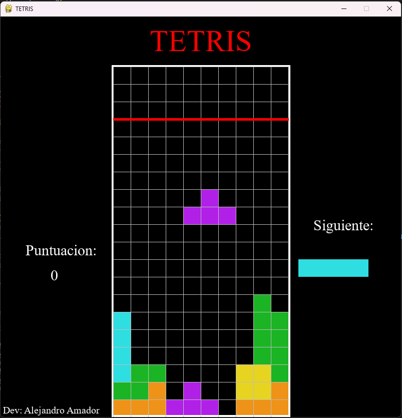

# TETRIS - Juego en Python

**Desarrollado por:** Alejandro Amador
**Tecnología:** Python 3 + Pygame

---

## 🎮 Descripción

Este es un clon del clásico juego **Tetris**, desarrollado completamente en Python usando la librería **Pygame**. Incluye:

* Físicas de colisión
* Rotación de fichas
* Sistema de puntuación
* Música y pausa
* Mejora progresiva de dificultad
* Interfaz de inicio y fin de juego

---

## 📊 Características

* Tablero de 10x20 bloques
* 7 tipos de fichas distintas (formas T, Z, S, I, O, L, J)
* Piezas con rotación
* Modo pausa con opciones
* Sistema de "next piece"
* Sonido de fondo

---

## 📚 Requisitos

* Python 3.6 o superior
* Pygame

### Instalación de dependencias:

```bash
pip install pygame
```

---

## ⛰ Estructura del Proyecto

```
Tetris/
├── main.py            # Archivo principal del juego
├── formas.py          # Formas de las fichas (matrices)
├── colores.py         # Colores asociados a cada ficha
├── theme.mp3          # Música de fondo
├── README.md          # Este archivo
```

---

## 🚀 Ejecución

Desde el directorio del proyecto:

```bash
python main.py
```

---

## ⌨️ Controles

* ⬆️ : Rotar ficha
* ⬇️ : Acelerar caída
* ⬅️ : Mover izquierda
* ➡️ : Mover derecha
* `P` : Pausar / Reanudar
* `R` : Reiniciar
* `ESC` : Salir
* `M` : Activar/Desactivar música
* `L` : Mostrar/Ocultar cuadrícula

---

## 🚀 Sistema de Puntuación

* Cada línea eliminada: **1000 puntos**
* Entre más filas elimines, mayor es la puntuación acumulada
* La velocidad de caída aumenta a medida que puntújes más

---

## 📅 Estado del Juego

* El juego termina cuando alguna ficha toca la parte superior del tablero

---

## 📷 Captura de pantalla (opcional)

Puedes incluir una captura de pantalla así:

```md

```

---

## 🚀 Créditos

**Desarrollador:** Alejandro Amador Ruiz
Este proyecto fue realizado con fines educativos y recreativos.

---

## 📝 Licencia

MIT License. Puedes usar y modificar libremente este código. ¡Atribución es apreciada!

---
